# 침착한 생성모델

## Introduction

Out of pure curiosity, I built a dataset of [malnyun cartoon faces](https://comic.naver.com/webtoon/list.nhn?titleId=103759) and tested some of the recently proposed deep generative models on it. With a pre-trained face generating model and special training techniques, I was able to train a generator at 256x256 resolution in about 10hrs on a single RTX 2080ti GPU using only 500 images.

## Data Preparation

I used the webcomics images of [이말년 aka 침착맨](https://www.youtube.com/channel/UCUj6rrhMTR9pipbAWBAMvUQ). The first attempt was to use a simple face detector on the comics images, but the cascade classifier for human faces provided in opencv does not work well on this cartoon domain.

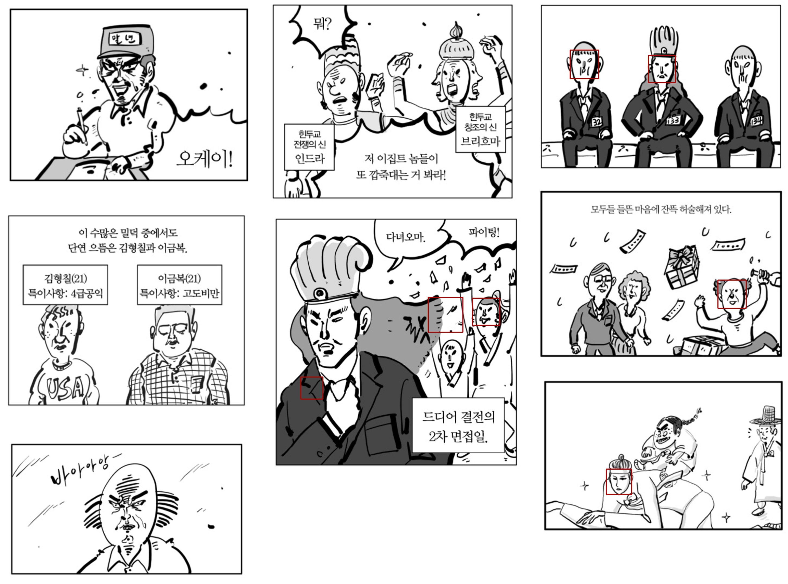

Neither does the [Nagadomi's animeface version](https://github.com/nagadomi/lbpcascade_animeface), so I decied to manually mark the boxes and ended up with 500 cartoon face images. Since the size of faces varies a lot depending on the scene, I used [CRAN-based cartoon super-resolution model](https://github.com/yu45020/Waifu2x) to upscale the small images to 256x256 resolution.

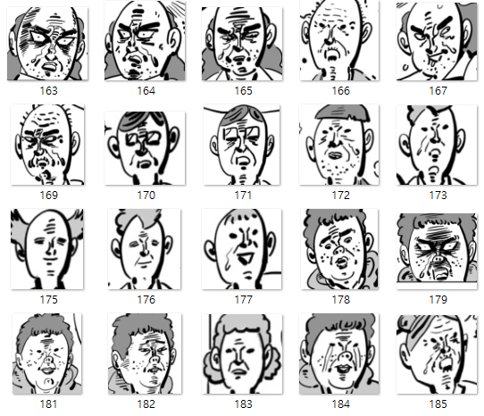

## StyleGAN + FreezeD

[FreezeD: A Simple Baseline for Fine-tuning GANs](https://arxiv.org/abs/2002.10964) freezes the first few layers of a trained discriminator and finetunes the model on a new dataset. I used styleGAN model trained on FFHQ dataset, and it took about 10hrs to finetune the pre-trained model for 50k steps on my environment.

[[original code]](https://github.com/sangwoomo/FreezeD)

Interestingly, some of the originally learned semantic features are mapped to the corresponding elements in the early stage of the training. The sunglasses turned into glaring eyes, and the hats turned into hairbands.

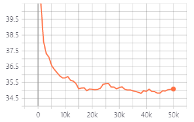

The FID converged after 20k steps, and there was no significant improvement in sample quality since then. Below are the style mixing results of the trained generator. The identity of each character and the facial expression/direction are disentangled quite well.

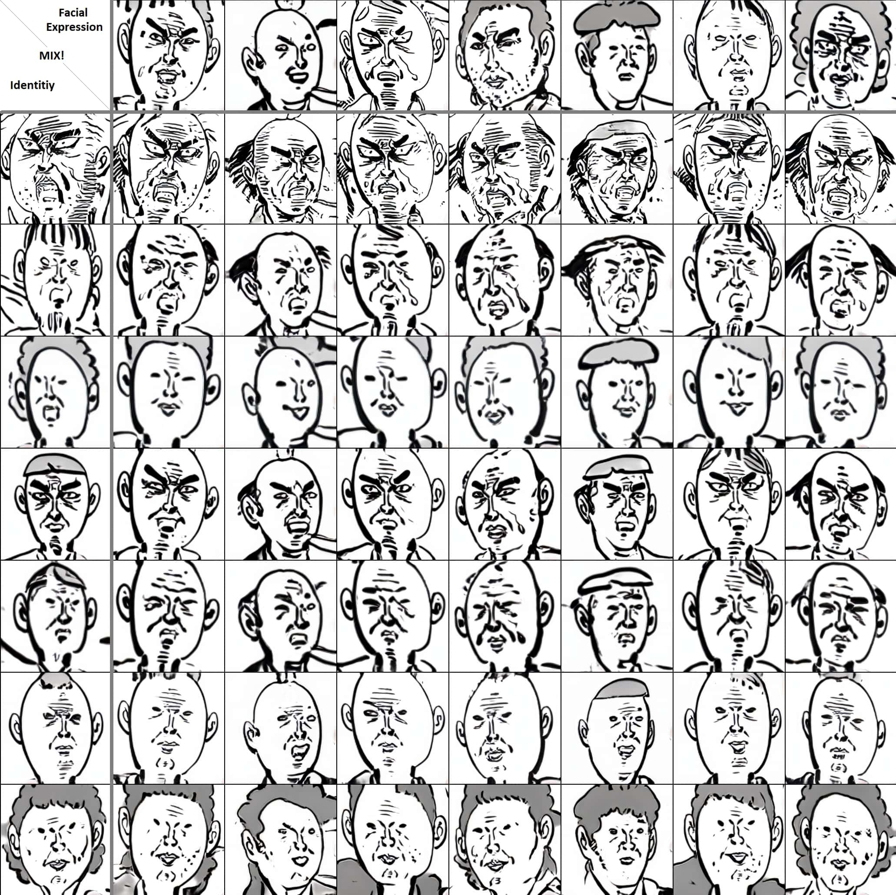

## StyleGAN2 + ADA

[Training Generative Adversarial Networks with Limited Data](https://arxiv.org/abs/2006.06676) uses differentiable non-leaking data augmentation on both the real and generated images, and the augmentation probability is adaptively chosen according to the discriminator output distribution. With the proposed augmentation, the authors managed to train the generator with only 1k images.

[[original code]](https://github.com/rosinality/stylegan2-pytorch)

In my experiments with the default settings, the model collapsed and could not recover from it when training from scratch.

Train from scratch: 100k steps

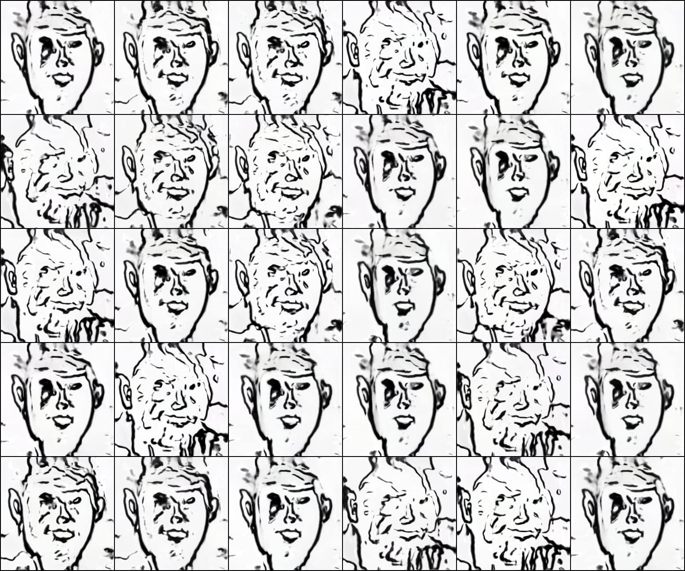

Starting from the FFHQ pre-trained model, it successfully learned to generate realistic cartoon images.

Transfer from FFHQ: 30k steps

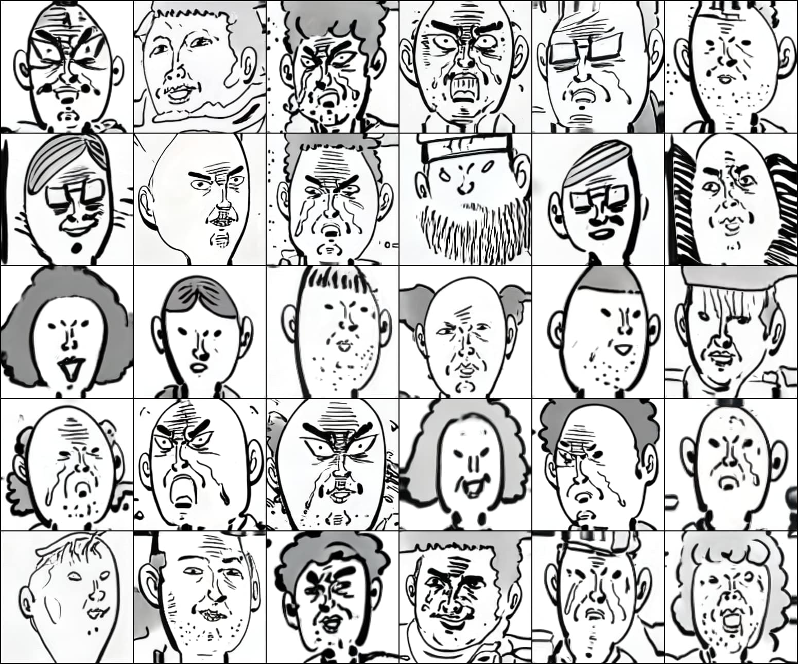

## Latent Space Exploration

### GANSpace

GANSpace samples a large number of style vectors and estimates the principal axes using the activated features.

[[original code]](https://github.com/harskish/ganspace)

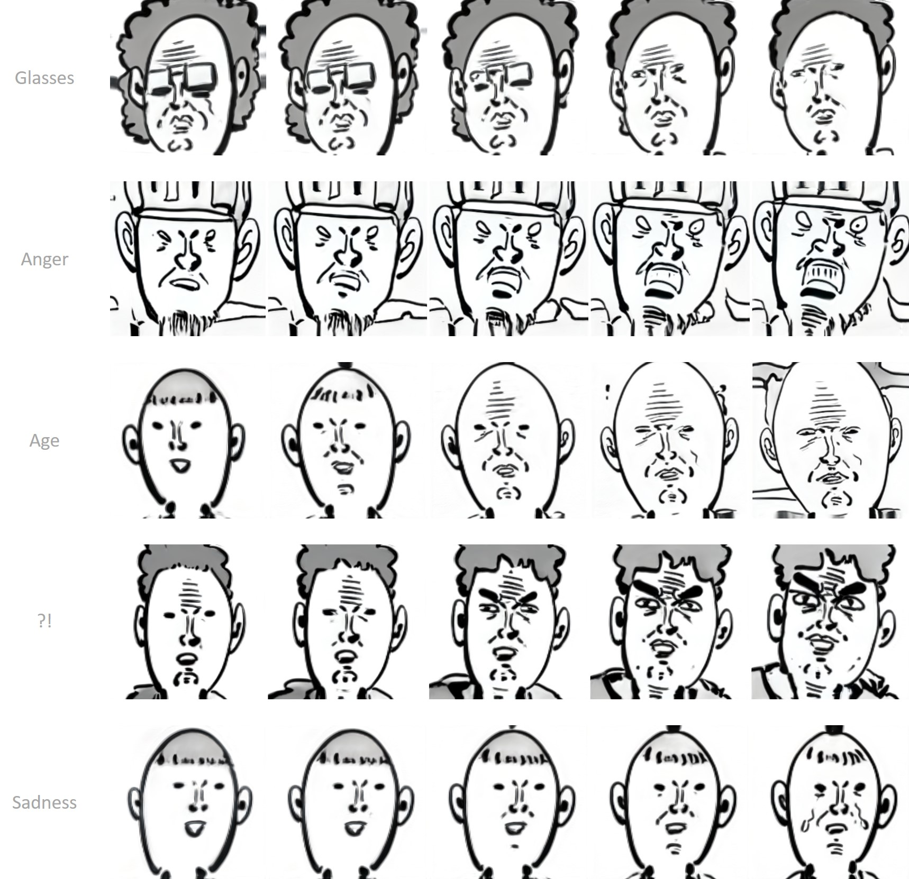

### Close-form factorization

Close-form factorization does not require sampling. It simply uses the eigen direction of the first affine layer's weight.

[[original code]](https://github.com/genforce/sefa)

I found [gradio](https://gradio.app/) module pretty useful for the latent space exploration. It lets one test the deep models interactively on web browsers.

*seed*\
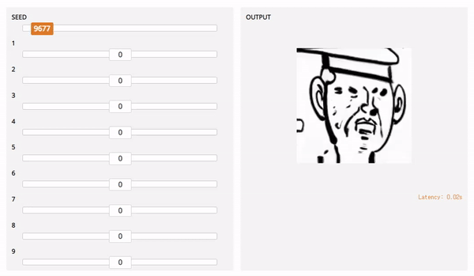

*hair*\
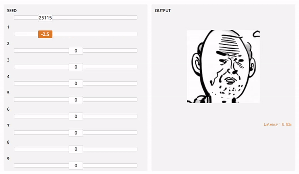

*mouth*\
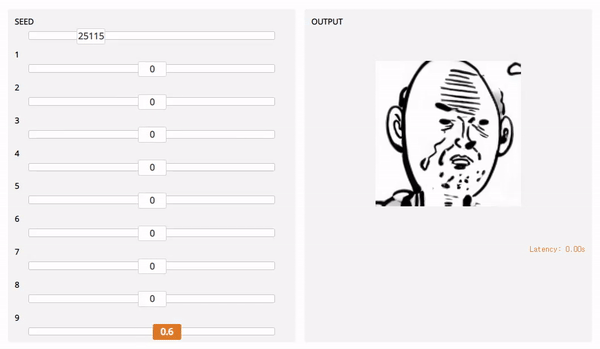 

*tilt*\
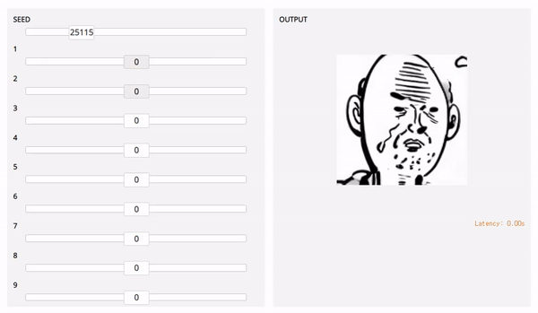

\*Meme generation time\*

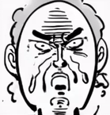 &nbsp; 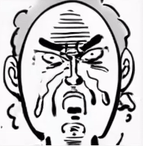 &nbsp; 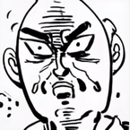 &nbsp; 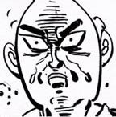 &nbsp;

## U-GAT-IT

[U-GAT-IT](https://arxiv.org/abs/1907.10830) is an image-to-image translation method that achieved great success in face2anime task. It uses CAM modules to extract the attention and AdaLIN modules to learn instance/layer norm balance. I used 1000 samples from [Asian face dataset](https://afad-dataset.github.io/) for the input faces. The model uses cycle-consistency loss with multiple discriminators and generators, so I had to downscale the images to 128x128 to fit batchsize 4 in 11GB GPU memory.

[[original code]](https://github.com/znxlwm/UGATIT-pytorch)

250k steps

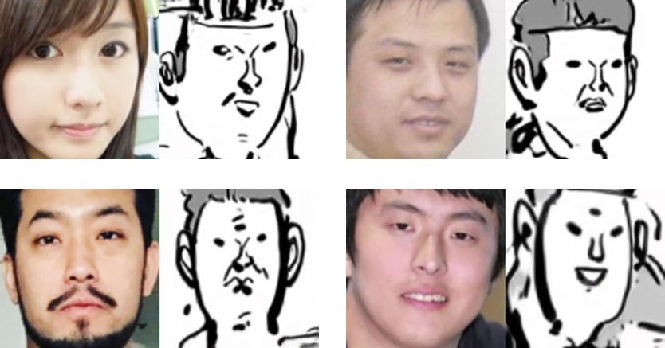

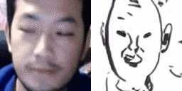

The model captures the direction and the shape of the face but does not preserve detailed attributes. It is mainly because U-GAT-IT is an unsupervised method that finds one-to-one mapping between the two distributions, but the attributes differ in the input and output domain.

## StyleGAN2 + U-GAT-IT

I attached the output of the FFHQ-trained styleGAN2 to the trained U-GAT-IT model to explore the learned space. Even though the face generation model is trained mostly on caucasian faces and the image translation model is trained on Asian faces, they work pretty well together.

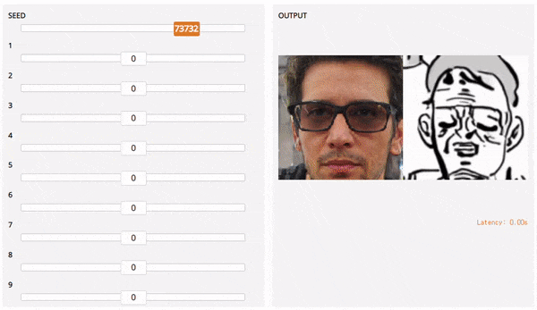

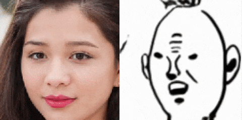 &nbsp; 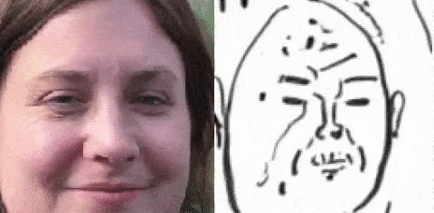 &nbsp;\
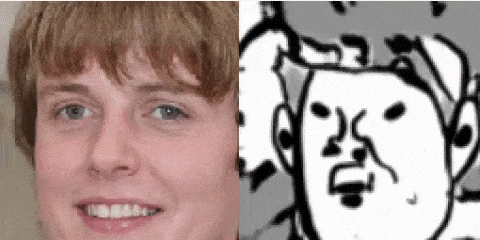 &nbsp; 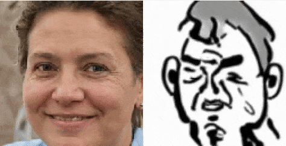 &nbsp;

## Conclusion

- By transferring the model that has already been trained on large data sharing similar semantics with small target dataset, it is possible to learn a 256 image generation model within half a day.
- Since the generative model essentially learns the distribution of prepared data, characteristics that are not present in the train data cannot be learned nor generated. If one wants to train an unsupervised image translation model that preserves the characteristics of a person (such as hairstyle, gender, etc.), one may need to prepare the data so that the distributions of the feature match, or approach it with a style transfer method that only changes the low-level texture.

